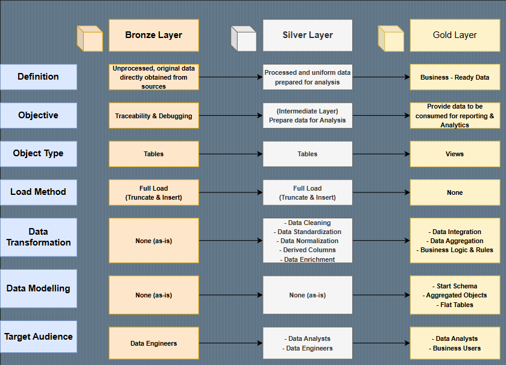
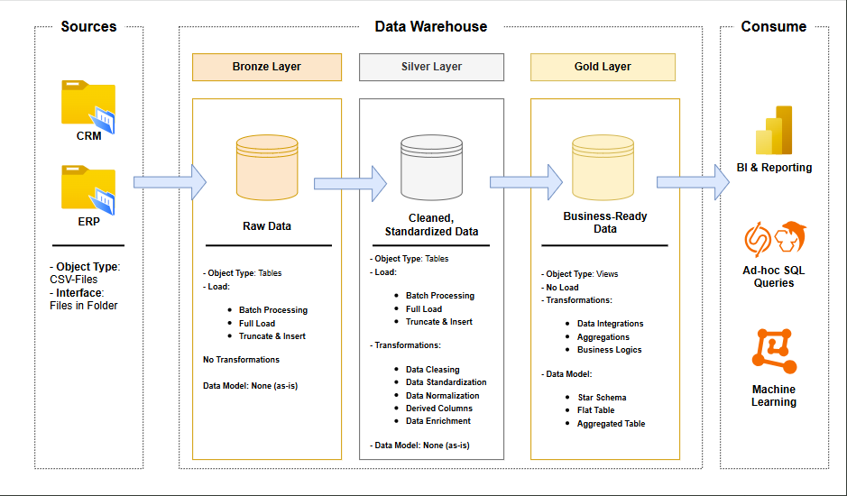

# 📊 Enterprise Data Warehouse Project – Summary Documentation

## 🔧 Project Overview

This project establishes an enterprise-grade **Data Warehouse** architecture to enable unified reporting, customer analytics, and product performance insights. It adopts the **Medallion Architecture** (Bronze → Silver → Gold) to manage data ingestion, cleaning, transformation, and reporting layers using structured pipelines and schema design.

---

## 🧱 Database & Schema Setup

### 🎯 Objective

The database environment is initialized with a repeatable script that:

- Drops and recreates a clean `DataWarehouse` instance
- Defines three schemas: `bronze`, `silver`, and `gold`
- Structures the warehouse to support scalable and layered ETL workflows

### 🗂️ Schema Structure

| Schema   | Purpose                                                  |
|----------|----------------------------------------------------------|
| `bronze` | Raw data from source systems with minimal to no changes |
| `silver` | Cleaned, standardized, and integrated data              |
| `gold`   | Business-ready views and star schema for analytics      |

---

## 🧹 Data Preparation Process

### 📁 Source Datasets

The project leverages multiple structured datasets to prepare a comprehensive data model:

- **Customer Data**: Demographics, birthdates, gender, location
- **Product Data**: SKUs, categories, cost, maintenance flags
- **Sales Data**: Orders, quantities, pricing, fulfillment timing

### 🔄 Transformation Pipeline

1. **Data Cleaning**
   - Standardized IDs (e.g., `NASA123` → `123`)
   - Unified date formats
   - Corrected gender mismatches
   - Parsed combined fields (e.g., birthdate)

2. **Data Integration**
   - Merged customer tables using common keys
   - Enriched products with category and maintenance data

3. **Enhancement & Feature Engineering**
   - Calculated customer age and tenure
   - Computed product lifecycle (active vs discontinued)
   - Derived fulfillment time and price categories

4. **Data Validation**
   - Ensured referential integrity (valid customers/products in sales)
   - Verified temporal logic (e.g., ship date ≥ order date)
   - Flagged sales tied to discontinued SKUs

5. **Optimization**
   - Generated surrogate keys for all entities
   - Normalized product hierarchy (Category → Subcategory)
   - Prepared outputs in SQL, CSV, and Parquet formats

### 🧰 Tools Used

- **Python**: ETL scripting and transformation logic
- **SQL Server**: Final storage and schema layering
- **Power BI**: Dashboard and visualization layer
- **Parquet/CSV**: Portable data format for large-scale analysis

---

## 🔎 Diagnostic Pipeline Verification

To confirm proper data flow across the layers, a diagnostic script was created that:

- **Counts records** in each table across Bronze, Silver, and Gold
- **Samples records** from key entities (customer, product, sales)
- **Tests joinability** between sales, product, and customer tables
- **Verifies star schema** integrity in the Gold layer

### ✅ Key Outcomes

| Layer   | Validation Focus                     |
|---------|--------------------------------------|
| Bronze  | Raw ingestion volume and formats     |
| Silver  | Standardization and type consistency |
| Gold    | Surrogate key logic and analytics readiness |

---

## 📊 Star Schema (Gold Layer)

The `gold` schema defines the final analytics-ready views:

### 🌟 Dimensions

- **dim_customers**: Merged CRM/ERP info + geo + birthdate
- **dim_products**: SKU + cost + category + maintenance

### 📈 Fact Table

- **fact_sales**: All sales metrics (quantity, price, timing) joined to dimension surrogate keys

---

## 🚀 Deployment Outputs

- 🗄️ Structured SQL database (`DataWarehouse`) with 3-layer schema
- 📂 Exported files in `.csv` and `.parquet` formats
- 📊 Power BI dashboards for:
  - Customer segmentation
  - Product performance
  - Order fulfillment metrics

---

## 🧠 Key Insights

- Bronze → Silver → Gold flow enables **traceability and governance**
- Star schema design ensures **BI tool compatibility**
- Diagnostics ensure **pipeline health and integrity**
- Python + SQL hybrid pipeline delivers **automation and control**

---

